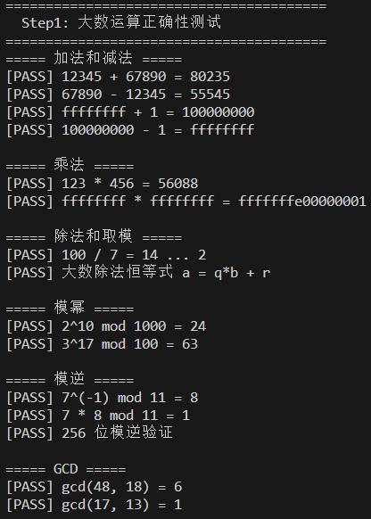
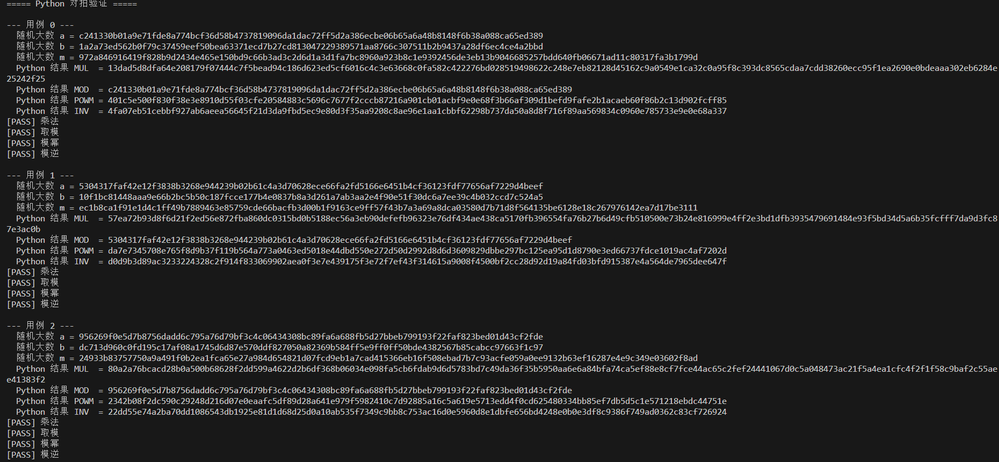
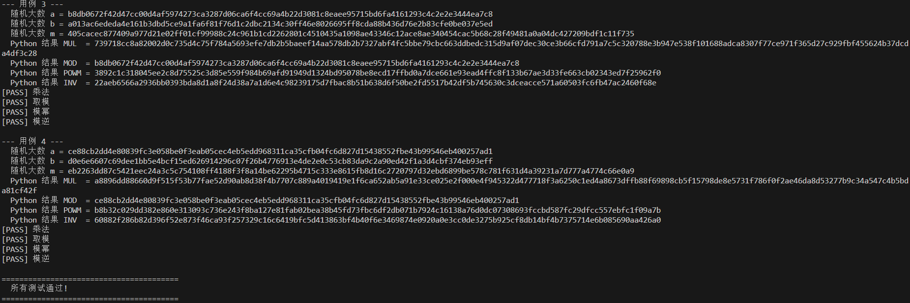
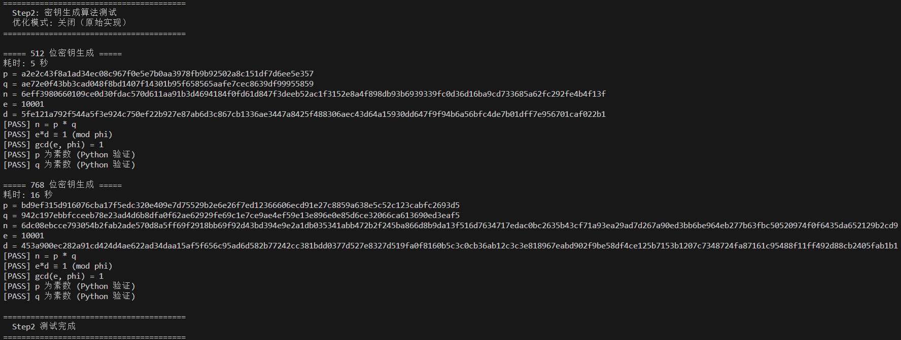
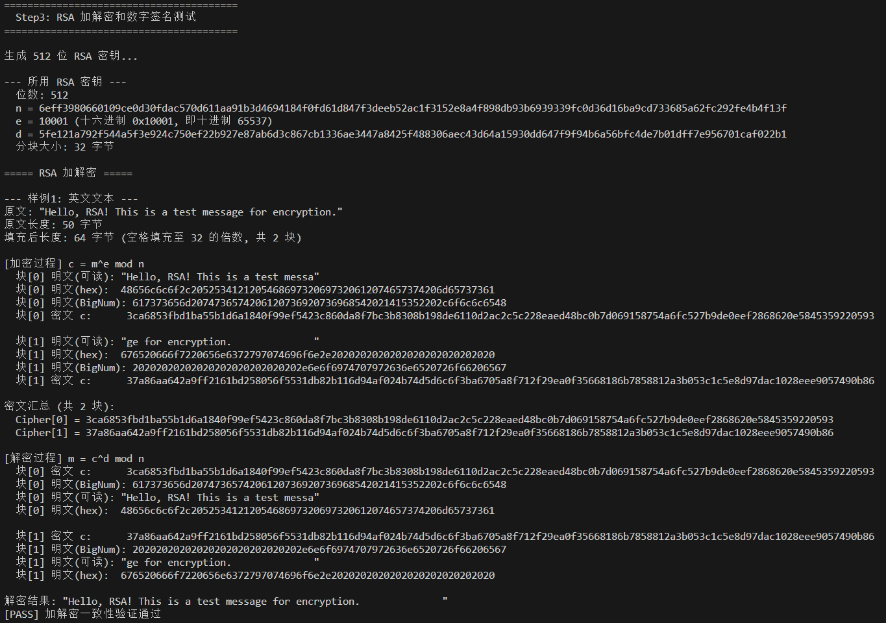
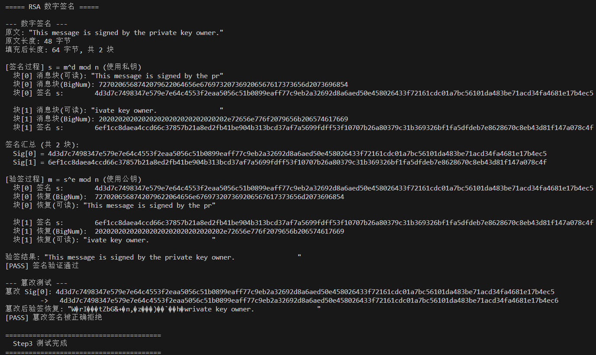
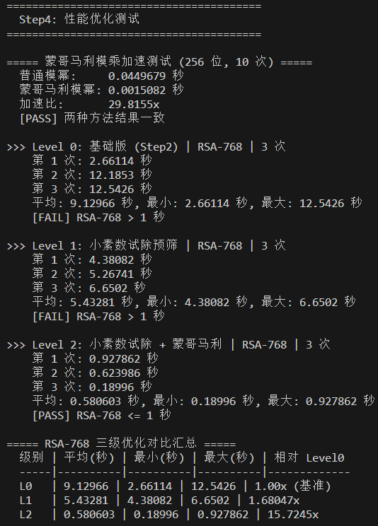
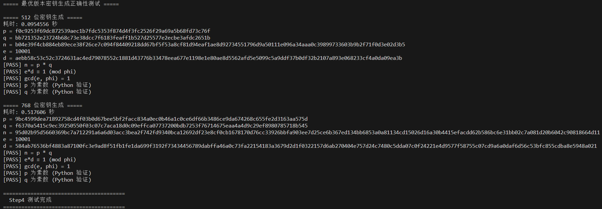

# RSA 加解密与数字签名实验报告
> 计37 郑东喆 2023010857

## Step1：大数运算
实现代码为`bignum.h`，测试代码为`step1_test.cpp`。

首先，每个 BigNum 元素的存储采取的数据结构是`uint32_t num[ARRAY_SIZE]; int bit_len`，将大数按每 32 个比特分块，最多容纳 128 个块，即 512 个字节，大数按照从低位到高位的顺序排布于 num 数组中。bit_len 表示 num 中有效比特的个数，对齐到 32。

其次，一些运算的实现：加减乘都模拟竖式计算，32 位数的加减乘至多产生 32 位的溢出。除法和取模调用统一的带余除法接口，其中用二进制长除法实现，从被除数的最高位开始，逐步左移余数并尝试减去除数，若能减则减并在商的高位写1，否则写0。模幂的实现利用已经写好的乘法运算，将指数按二进制拆开，指数逐步右移，遇到 1 则 `result *= a`并`a *= a`。模逆的实现使用扩展欧几里得算法，最大公约数的实现使用辗转相除法。另外实现了一些辅助函数。

测试方法：手动构造一些简单的测例（如小数和简单的大数运算，检验进位等机制的正确性），然后使用 python 脚本随机生成一些大数，将 BigNum 运算与 python 给出的标准答案（`test_data.py`）对拍。因为 python 自带对任意精度整数的支持，自带高精度运算，可以直接作为对拍的标准，测试代码为`step1_test.cpp`。

运行方法为

```bash
g++ -O3 -std=c++17 step1_test.cpp -o step1_test
./step1_test
```

运行结果为：







## Step2：密钥生成

密钥生成的核心是找大素数，需要实现 Miller-Rabin 概率素性测试：给定待测数 n，先把 n-1 写成 d·2^r 的形式，然后随机选底数 a，计算 x = a^d mod n。如果 x 等于 1 或 n-1，说明这一轮没有发现问题；否则反复平方最多 r-1 次，看能不能遇到 n-1。如果平方过程中提前遇到 1，或者始终遇不到 n-1，就判定 n 是合数。重复选择 a，如果 20 轮都没有找到反例，就认为 n 很可能是素数。

找素数时不是每次都重新随机，而是从一个随机奇数出发，每次加 2 做增量搜索，同时跳过很容易判断的 3 的倍数，以提升效率。

这部分代码在`rsa.cpp`的`BigNum generatePrime(int bits)`函数，其会从一个随机的bits 位的奇数开始，按上述方法逐步找素数，找 100000 次，并设计了兜底机制，如果 10000 次都没找到就再次调用`generatePrime`重新随机起始点。

我们通过`generatePrime`找到指定位数（也就是密钥位数/2）的素数 p 和 q，然后按照 RSA 的流程生成密钥：$n=pq,~\phi(n)=(p-1)(q-1),~(e,\phi(n))=1,~d=e^{-1}\mod \phi(n)$。`n,d,e,p,q`共同构成 RSA 密钥结构体。

其中唯一值得一提的是 e 的寻找，采取了一种比较野蛮的方法，从一个候选集里面逐一遍历，返回第一个满足与 $\phi(n)$ 互素的作为 e，基本就是 65537（`0x10001`）。

测试代码是`step2_test.cpp`，其会测试 512 位和 768 位密钥生成（支持很轻易地添加其余比特位的密钥生成测试），验证是否满足 RSA 要求的各个等式，并验证 p 和 q 是否真的是素数，这里标准实现采用的是用 python 实现一个 Miller-Rabin 算法（`verify_prime.py`），利用的还是 python 支持任意精度整型的优势（不考虑 python 中算法实现错误）。

运行方法为（不添加优化）：

```bash
g++ -O3 -std=c++17 -o step2_test step2_test.cpp rsa.cpp montgomery.cpp
./step2_test
```

运行结果为（每次运行得到的 p 和 q 是随机、不一致的）：



512位密钥生成的文字版结果：
```
===== 512 位密钥生成 =====
耗时: 5 秒
p = a2e2c43f8a1ad34ec08c967f0e5e7b0aa3978fb9b92502a8c151df7d6ee5e357
q = ae72e0f43bb3cad048f8bd1407f14301b95f658565aafe7cec8639df99955859
n = 6eff3980660109ce0d30fdac570d611aa91b3d4694184f0fd61d847f3deeb52ac1f3152e8a4f898db93b6939339fc0d36d16ba9cd733685a62fc292fe4b4f13f
e = 10001
d = 5fe121a792f544a5f3e924c750ef22b927e87ab6d3c867cb1336ae3447a8425f488306aec43d64a15930dd647f9f94b6a56bfc4de7b01dff7e956701caf022b1
[PASS] n = p * q
[PASS] e*d ≡ 1 (mod phi)
[PASS] gcd(e, phi) = 1
[PASS] p 为素数 (Python 验证)
[PASS] q 为素数 (Python 验证)
```

## Step3：加解密与数字签名

这一步非常简单，RSA 的加密和解密本质上都是模幂运算：加密计算 c = m^e mod n，解密计算 m = c^d mod n。签名和验签也是同样的运算，只是变为签名用私钥指数 d，验签用公钥指数 e。因为 n 的大小限制了单次能处理的消息长度，我把字符串按 32 字节一块切开，每块转成 `BigNum` 后独立运算，解密或验签时再拼回字符串。块与块之间用空格填充到 32 字节的整数倍。

测试样例包括一段英文（"Hello, RSA! This is a test message for encryption."）和一段十六进制字符串（"deadbeefcafebabe0123456789abcdef"），分别验证加解密后与原明文的一致性。签名测试用另一段英文消息，验证签名后能否正确恢复原文，还做了一个篡改测试：把签名的第一个块加 1 之后，验签结果应当与原文不同。

运行方法为（不添加优化）：

```bash
g++ -O3 -std=c++17 -o step3_test step3_test.cpp rsa.cpp montgomery.cpp
./step3_test
```

运行结果为（仅展示部分，全部结果可运行后自行查看）：





## Step4：性能优化

Step2 的基础版对每个候选数直接做 20 轮 Miller-Rabin，模幂走普通的平方-乘算法，每次取模都要做完整的二进制长除法，RSA-768 密钥生成平均需要15~16秒。本步骤主要做了三方面优化：

1. 在 Miller-Rabin 算法单轮判断 n 是否为素数时，本来要随机选取 20 个 a 逐一尝试，现利用 C++ 的短路求值，写成`millerRabin(candidate, 3) && millerRabin(candidate, 15)`，如果 3 轮快速筛选已经不通过就不必跑剩下 15 轮（也将总轮数从 20 降至 18），此优化后能将 RSA-768 的密钥生成时间降至 9 秒左右。
2. 同样在 Miller-Rabin 中，我们试图让一些明显不是素数的候选数尽早被筛除而不进入 Miller-Rabin 的循环，为此，我们在循环之前先判断这个数能否被一些可列举的小素数（5-997之间的素数）整除，若能则直接跳过。加入此优化后，RSA-768 的密钥生成降至 3 秒左右，有显著加速作用但仍不足。
3. 现有实现中，模幂和模乘的实现都依赖二进制长除法（模幂更是每次循环都需要一次长除），这是比较缓慢的，查阅资料后发现可以用蒙哥马利乘法来优化。其用移位和加法代替长除法进行约简，可以显著提升性能。

性能测试在 `step4_test.cpp` 中完成，包含两部分：一是对比普通模幂与蒙哥马利模幂在 256 位下的单次平均耗时；二是分别用 Level 0（基础版）、Level 1（仅小素数试除）、Level 2（试除 + 两阶段 MR + 蒙哥马利）各生成 3 次 RSA-768 密钥，统计耗时并汇总加速比。

性能测试的结果如下：



Level 2 平均 0.56 秒，满足 RSA-768 密钥生成不超过 1 秒的要求（第一次密钥生成还额外计算了一些初始化时间）。蒙哥马利模乘单独测试显示 256 位模幂加速约 34 倍，两种方法结果一致，不影响正确性。

最优版本的密钥生成测试结果为：



运行方法为：

```bash
g++ -O3 -std=c++17 -o step4_test step4_test.cpp rsa.cpp montgomery.cpp
./step4_test
```

### 附录

整个测试也可以用项目里的 Makefile 一键编译：

```bash
make all
./step1_test
./step2_test
./step3_test
./step4_test
```

同时，项目也已在 Github 上开源（[仓库链接](https://github.com/qsyyk-z/RSA)）。
